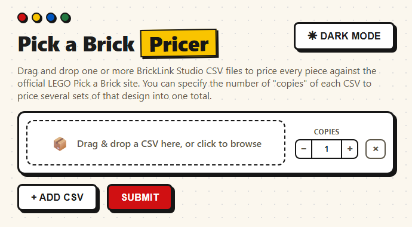
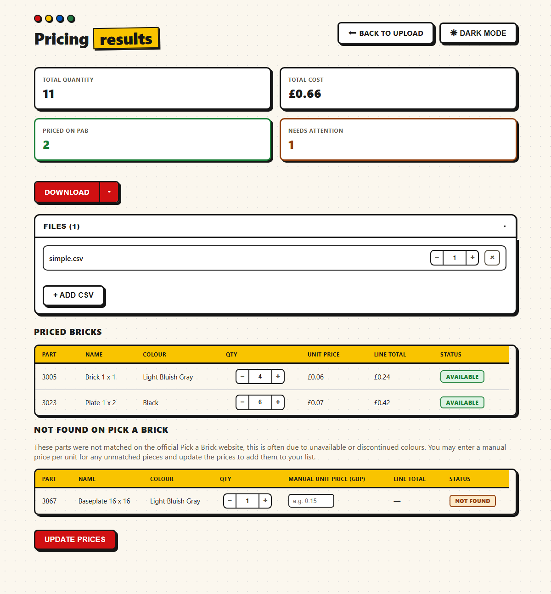

# LEGO Pick a Brick Pricer

Prices the parts in a bricks CSV (BLItemNo/ElementId/Qty, e.g. a BrickLink XML export
converted to CSV) against the official LEGO Pick a Brick website, in GBP.

Ships as both a CLI and a small FastAPI web UI, and is Dockerized so it doesn't depend
on the host's Python version.

## Screenshots

Upload one or more CSVs, with a "copies" count per file:



Priced results, with a "not found" table for manual pricing and a download dropdown:



## Quick start (Docker, recommended)

```
make start     # build image + run the web UI at http://localhost:8000
make stop      # tear it down
make restart   # stop + start
```

Or price a CSV without the web UI:

```
make docker-price CSV=input/your_parts_list.csv
```

Priced CSVs are written to `outputs/`.

## Web UI

Drag in one or more CSVs at `http://localhost:8000`. Each file gets its own row with
a "Copies" count, so you can price several builds at once (e.g. 3&times; one list
and 17&times; another) as a single aggregate total. Files are validated as CSV both
in the browser and on the server before pricing. You'll get:

- A priced table for every part LEGO's site matched, with GBP unit/line totals
  (rounded to 2dp).
- A "not found" table (usually discontinued colours PAB no longer sells) where you
  can enter a manual unit price to accept it into the total. The same missing piece
  is combined into one row even if it appeared in multiple uploaded CSVs.
- A "Download" button for the final, reconciled result, with a dropdown for either
  format:
  - **Simple** (default) — one row per unique part/colour with combined qty and
    line total.
  - **Detailed** — every priced line item as-is.

  Both are saved as `outputs/<timestamp>_simple.csv` / `outputs/<timestamp>_detailed.csv`.

## Native (no Docker)

Requires Python 3.11+ and `curl` on PATH (curl.exe ships with Windows 10/11, macOS,
and most Linux distros).

```
make install
make price CSV=input/your_parts_list.csv   # CLI
make web                                   # web UI at http://localhost:8000
```

## How pricing works

There's no public LEGO pricing API. The pricer requests LEGO's Pick a Brick search
page (`?query=<part number>`) and reads the embedded Next.js/Apollo state, which
lists every colour/element variant of that part along with its GBP price and
availability. Each row's exact `ElementId` is matched against that list.

LEGO's site sits behind Cloudflare bot detection that blocks Python's `requests`
library by TLS fingerprint but allows plain `curl` — so the fetcher shells out to
`curl` instead of using a Python HTTP client.

## Input CSV format

Expects at least these columns: `BLItemNo`, `ElementId`, `PartName`, `Qty`. Rows
missing any of these, or blank/summary rows, are skipped.

Local part-list CSVs can be kept in `input/`, which is gitignored.
